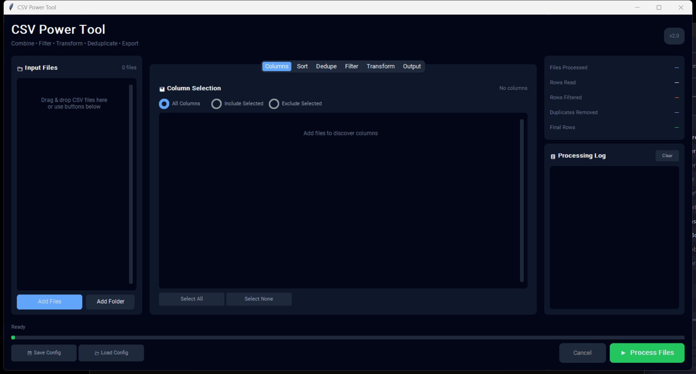

# CSV Power Tool

<p align="center">
  
  
  
  
</p>

<p align="center">
  <b>A professional-grade CSV file combiner and processor.</b><br>
  Merge, filter, transform, deduplicate, and export CSV data with full control.
</p>


---




## ✨ Features

### 📁 File Management
- **Drag & drop** support for adding files
- Add individual files or entire folders
- Support for CSV, TSV, and TXT files
- Auto-detection of file delimiters and encodings
- Process unlimited files at once

### 📊 Column Control
- Auto-discover columns across all files
- Three selection modes: All / Include Selected / Exclude Selected
- Select/deselect individual columns
- Handles files with different column structures

### 🔤 Multi-Column Sorting
- Sort by multiple columns with priority ordering
- Ascending (A→Z) or Descending (Z→A) per column
- Case-sensitive or case-insensitive sorting
- Numeric-aware sorting (sorts "2" before "10")

### 🔄 Deduplication
- Remove duplicate rows automatically
- Keep first or last occurrence
- Deduplicate based on all columns or specific columns only

### 🔍 Advanced Filtering
- Multiple filter rules with AND/OR logic
- 11 filter operators:
  - Equals / Not Equals
  - Contains / Not Contains
  - Starts With / Ends With
  - Is Empty / Is Not Empty
  - Greater Than / Less Than
  - Regex Match

### ⚙️ Data Transformations
- Trim whitespace from all cells
- Case transformation: UPPER, lower, Title Case
- Replace empty cells with custom values

### 💾 Flexible Output
- **Delimiters:** Comma, Semicolon, Tab, Pipe
- **Encodings:** UTF-8, UTF-16, Latin-1, CP1252
- **Quoting:** Minimal, All, Non-numeric, None
- **Line endings:** Auto, Unix (LF), Windows (CRLF)
- Include or exclude header row

### 🎯 Additional Features
- Save and load configuration presets (JSON)
- Real-time processing log with color-coded messages
- Live statistics panel
- Cancel button for long operations
- Modern dark theme UI

---

## 🚀 Installation

### Prerequisites
- Python 3.10 or higher

### Quick Start

1. **Clone the repository:**
   ```bash
   git clone https://github.com/yourusername/csv-power-tool.git
   cd csv-power-tool
   ```

2. **Run the application:**
   ```bash
   python csv_power_tool.py
   ```

   The application will automatically install required dependencies on first run:
   - `customtkinter` - Modern GUI framework
   - `tkinterdnd2` - Drag and drop support

### Manual Dependency Installation (Optional)
```bash
pip install customtkinter tkinterdnd2
```

---

## 📖 Usage

### Basic Workflow

1. **Add Files**
   - Drag & drop CSV files onto the application
   - Click "Add Files" to browse for specific files
   - Click "Add Folder" to add all CSVs from a directory

2. **Configure Processing** (use the tabs)
   - **Columns:** Select which columns to include in output
   - **Sort:** Define sort order with multiple columns
   - **Dedupe:** Configure duplicate removal
   - **Filter:** Add filter rules to include/exclude rows
   - **Transform:** Apply text transformations
   - **Output:** Set delimiter, encoding, and output file path

3. **Process**
   - Click "▶ Process Files" to start
   - Monitor progress in the log panel
   - View statistics when complete

### Configuration Presets

Save your frequently used configurations:

1. Set up your desired options across all tabs
2. Click "💾 Save Config"
3. Choose a location to save the JSON preset

Load a saved configuration:

1. Click "📂 Load Config"
2. Select a previously saved JSON file
3. All settings will be restored

---

## 🔧 Configuration Reference

### Filter Operators

| Operator | Description | Example |
|----------|-------------|---------|
| `Equals` | Exact match (case-insensitive) | "USA" matches "usa" |
| `Not Equals` | Does not match | Exclude "N/A" values |
| `Contains` | Substring match | "john" in "John Smith" |
| `Not Contains` | Substring not present | Exclude emails with "spam" |
| `Starts With` | Prefix match | URLs starting with "https" |
| `Ends With` | Suffix match | Files ending with ".pdf" |
| `Is Empty` | Cell is blank | Find missing data |
| `Is Not Empty` | Cell has value | Only complete records |
| `Greater Than` | Numeric comparison | Sales > 1000 |
| `Less Than` | Numeric comparison | Age < 30 |
| `Regex Match` | Regular expression | Pattern matching |

### Output Encodings

| Encoding | Use Case |
|----------|----------|
| `UTF-8` | Universal, recommended for most uses |
| `UTF-16` | Windows Unicode applications |
| `Latin-1` | Western European legacy systems |
| `CP1252` | Windows Western European |

---

## 📋 Requirements

| Package | Version | Purpose |
|---------|---------|---------|
| Python | 3.10+ | Runtime |
| customtkinter | Latest | Modern GUI framework |
| tkinterdnd2 | Latest | Drag and drop support |

---

## 📄 License

This project is licensed under the MIT License - see the [LICENSE](LICENSE) file for details.

```
MIT License

Copyright (c) 2025

Permission is hereby granted, free of charge, to any person obtaining a copy
of this software and associated documentation files (the "Software"), to deal
in the Software without restriction, including without limitation the rights
to use, copy, modify, merge, publish, distribute, sublicense, and/or sell
copies of the Software, and to permit persons to whom the Software is
furnished to do so, subject to the following conditions:

The above copyright notice and this permission notice shall be included in all
copies or substantial portions of the Software.

THE SOFTWARE IS PROVIDED "AS IS", WITHOUT WARRANTY OF ANY KIND, EXPRESS OR
IMPLIED, INCLUDING BUT NOT LIMITED TO THE WARRANTIES OF MERCHANTABILITY,
FITNESS FOR A PARTICULAR PURPOSE AND NONINFRINGEMENT. IN NO EVENT SHALL THE
AUTHORS OR COPYRIGHT HOLDERS BE LIABLE FOR ANY CLAIM, DAMAGES OR OTHER
LIABILITY, WHETHER IN AN ACTION OF CONTRACT, TORT OR OTHERWISE, ARISING FROM,
OUT OF OR IN CONNECTION WITH THE SOFTWARE OR THE USE OR OTHER DEALINGS IN THE
SOFTWARE.
```

---

## 🙏 Acknowledgments

- [CustomTkinter](https://github.com/TomSchimansky/CustomTkinter) - Modern UI framework
- [TkinterDnD2](https://github.com/pmgagne/tkinterdnd2) - Drag and drop functionality

---

<p align="center">
  Made with ❤️ for data wranglers everywhere
</p>

