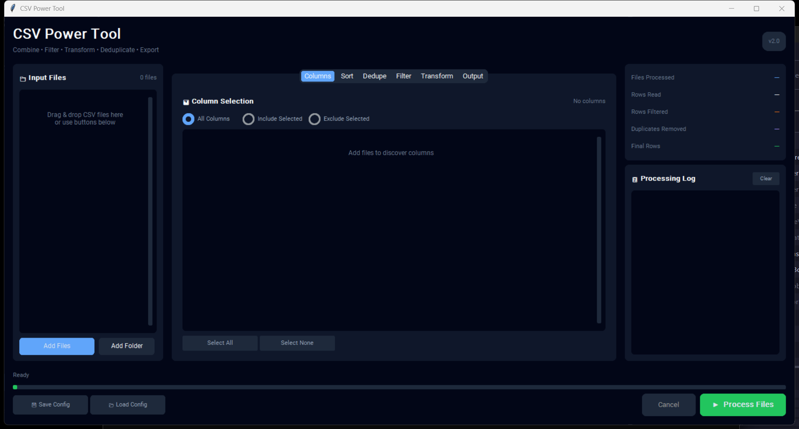

# CSV Power Tool

<p align="center">
  
  
  
  
</p>

<p align="center">
  <b>A professional-grade CSV file combiner and processor.</b><br>
  Merge, filter, transform, deduplicate, and export CSV data with full control.
</p>


---




## ✨ Features

### 📁 File Management
- **Drag & drop** support for adding files
- Add individual files or entire folders
- Support for CSV, TSV, TXT, Excel `.xlsx`, and Parquet files
- Support for JSON Lines / NDJSON input and output
- Auto-detection of file delimiters and encodings
- Schema-drift reports with samples, inferred types, and detection confidence
- Frictionless-compatible Table Schema contracts with strict, advisory, and quarantine validation
- Recursive folder import
- Process unlimited files at once

### 📊 Column Control
- Auto-discover columns across all files
- Three selection modes: All / Include Selected / Exclude Selected
- Select/deselect individual columns
- Handles files with different column structures

### 🔤 Multi-Column Sorting
- Sort by multiple columns with priority ordering
- Ascending (A→Z) or Descending (Z→A) per column
- Case-sensitive or case-insensitive sorting
- Numeric-aware sorting (sorts "2" before "10")

### 🔄 Deduplication
- Remove duplicate rows automatically
- Keep first or last occurrence
- Deduplicate based on all columns or specific columns only

### 🔍 Advanced Filtering
- Multiple filter rules with AND/OR logic
- 17 filter operators:
  - Equals / Not Equals
  - Contains / Not Contains
  - Starts With / Ends With
  - Is Empty / Is Not Empty
  - Greater Than / Less Than
  - Regex Match
- Date-aware `Between` filtering with timezone normalization
- Fuzzy match filtering
- Fuzzy duplicate matching with aggregate modes
- Optional source-file provenance column and canonical column template ordering
- SQL-style inner, left, right, and outer joins from the CLI
- Keyed three-way CSV merge with configurable conflict resolution
- Optional sensitive-value redaction

### ⚙️ Data Transformations
- Trim whitespace from all cells
- Case transformation: UPPER, lower, Title Case
- Replace empty cells with custom values

### 💾 Flexible Output
- **Delimiters:** Comma, Semicolon, Tab, Pipe
- **Encodings:** UTF-8, UTF-16, Latin-1, CP1252
- **Quoting:** Minimal, All, Non-numeric, None
- **Line endings:** Auto, Unix (LF), Windows (CRLF)
- **Formats:** CSV, TSV, TXT, JSONL/NDJSON, Excel `.xlsx`, Parquet
- Include or exclude header row

### 🎯 Additional Features
- Save and load configuration presets (JSON)
- CLI mode with recursive inputs, filters, fuzzy dedupe, and watch mode
- CLI pivot/unpivot reshaping and machine-readable schema reports
- DuckDB SQL mode over named input views and a loopback-only upload API
- Optional Polars text backend for large in-memory jobs (`--backend polars`)
- Bounded-memory streaming for text inputs when sort and dedupe are disabled
- Real-time processing log with color-coded messages
- Live statistics panel
- Projected-output preview (first 100 rows) with per-column row/distinct/type summary
- Drag-reorderable output columns and undo/redo for preset edits
- Dark, Light, and System appearance modes
- Cancel button for long operations
- Modern dark theme UI

---

## 🚀 Installation

### Prerequisites
- Python 3.10 or higher

### Quick Start

1. **Clone the repository:**
   ```bash
   git clone https://github.com/yourusername/csv-power-tool.git
   cd csv-power-tool
   ```

2. **Run the application:**
   ```bash
   python -m pip install -r requirements.txt
   python CSV_Consolidator.py
   ```

### CLI Mode
```bash
python CSV_Consolidator.py --inputs data/*.csv --output combined.csv
python CSV_Consolidator.py --inputs exports --filter "date:between:2024-01-01..2024-12-31" --output filtered.xlsx
python CSV_Consolidator.py --inputs exports --fuzzy-dedupe-threshold 88 --output deduped.parquet
python CSV_Consolidator.py --inputs exports --dedupe-preview duplicate-preview.json
python CSV_Consolidator.py --watch --inputs exports --output combined.csv
python CSV_Consolidator.py --inputs exports --source-column "(Source)" --schema-report schema.json --output combined.csv
python CSV_Consolidator.py --inputs data/*.csv --export-schema contract.json
python CSV_Consolidator.py --inputs data/*.csv --schema-contract contract.json --validate-only --validation-report validation.json
python CSV_Consolidator.py --inputs data/*.csv --schema-contract contract.json --validation-mode quarantine --quarantine rejected.jsonl --output validated.csv
python CSV_Consolidator.py --inputs left.csv right.csv --join-on id --join-type outer --output joined.csv
python CSV_Consolidator.py --three-way-base base.csv --three-way-ours ours.csv --three-way-theirs theirs.csv --key-columns id --output merged.csv
python CSV_Consolidator.py --inputs data/*.csv --sql "SELECT * FROM input_0 WHERE amount > 100" --output query.csv
python CSV_Consolidator.py --inputs data/*.csv --invalid-row-policy quarantine --quarantine rejected.jsonl --output cleaned.csv
python CSV_Consolidator.py --inputs data/*.csv --collision-policy backup --output combined.csv
python CSV_Consolidator.py --inputs data/*.csv --output combined.csv --dry-run --save-workflow workflow.json
python CSV_Consolidator.py --replay workflow.json
python CSV_Consolidator.py --inputs data/*.csv --output combined.csv --workflow-history workflow-history.json
python CSV_Consolidator.py --serve --port 8765
```

SQL mode exposes each input as `input_0`, `input_1`, and so on through DuckDB. The opt-in upload API accepts raw file POSTs or browser-style multipart uploads at `POST /process` and exposes `GET /health`; it binds to localhost only, requires the per-run token printed at startup in `X-CSV-Power-Token` (or `Authorization: Bearer ...`), validates loopback Host/Origin headers, limits requests to 50 MiB and four active requests, and removes request files after processing. SQL is intentionally unavailable through the upload endpoint.

Input processing defaults to failing safely on malformed rows, oversized cells, excessive rows/columns, invalid containers, and over-deep JSON. Use `--invalid-row-policy warn` to retain repairable ragged rows with warnings, or `--invalid-row-policy quarantine --quarantine rejected.jsonl` to omit malformed rows and record their source locations. Successful outputs are written through a same-directory temporary file and accompanied by `<output>.manifest.json`, containing input/output hashes, schema counts, configuration identity, warnings, and errors. Use `--collision-policy fail` or `backup` to control existing destinations, or `--no-manifest` when an audit sidecar is not wanted.

Schema contracts use a documented first-version subset of the [Frictionless Table Schema](https://specs.frictionlessdata.io/table-schema/) format. `--export-schema` infers reusable field types and required/unique hints. `--schema-contract` accepts JSON contracts with string, integer, number, boolean, date, and datetime fields plus required, nullable, unique, missing-value, and primary-key constraints. `--validation-mode strict` preserves the existing output on any contract failure, `advisory` keeps rows and records warnings, and `quarantine` omits invalid rows into the JSONL quarantine file. `--validation-report` writes file/row/column/rule/observed-value diagnostics; `--validate-only` performs the same input validation without writing processed output. Unsupported Table Schema features are rejected explicitly.

Workflow files are versioned JSON documents with ordered operations, input patterns, output policy, configuration identity, and captured input metadata. `--dry-run` validates and prints the deterministic document without writing output; `--replay` can recover its inputs and output path; `--workflow-history` appends successful runs to bounded atomic history with changed-field metadata. Legacy plain configuration JSON is migrated when loaded.

### Packaging

Build unsigned Windows artifacts locally:

```bash
python packaging/build.py
python packaging/build.py --msi
```

The build prints SHA-256 hashes for the one-file executable and optional WiX MSI. No code-signing step is used.
The default build removes stale executable output, performs a clean PyInstaller build, and writes
`dist/CSV_Power_Tool.dependencies.json` with the locked runtime component versions and detected license metadata.
Use `python packaging/build.py --reuse` only when intentionally reusing an already verified executable.

---

## 📖 Usage

### Basic Workflow

1. **Add Files**
   - Drag & drop CSV files onto the application
   - Click "Add Files" to browse for specific files
   - Click "Add Folder" to add all CSVs from a directory

2. **Configure Processing** (use the tabs)
   - **Columns:** Select which columns to include in output
   - **Sort:** Define sort order with multiple columns
   - **Dedupe:** Configure duplicate removal
   - **Filter:** Add filter rules to include/exclude rows
   - **Transform:** Apply text transformations
   - **Output:** Set delimiter, encoding, and output file path

3. **Process**
   - Click "▶ Process Files" to start
   - Monitor progress in the log panel
   - View statistics when complete

### Configuration Presets

Save your frequently used configurations:

1. Set up your desired options across all tabs
2. Click "💾 Save Config"
3. Choose a location to save the JSON preset

Load a saved configuration:

1. Click "📂 Load Config"
2. Select a previously saved JSON file
3. All settings will be restored

---

## 🔧 Configuration Reference

### Filter Operators

| Operator | Description | Example |
|----------|-------------|---------|
| `Equals` | Exact match (case-insensitive) | "USA" matches "usa" |
| `Not Equals` | Does not match | Exclude "N/A" values |
| `Contains` | Substring match | "john" in "John Smith" |
| `Not Contains` | Substring not present | Exclude emails with "spam" |
| `Starts With` | Prefix match | URLs starting with "https" |
| `Ends With` | Suffix match | Files ending with ".pdf" |
| `Is Empty` | Cell is blank | Find missing data |
| `Is Not Empty` | Cell has value | Only complete records |
| `Greater Than` | Numeric comparison | Sales > 1000 |
| `Less Than` | Numeric comparison | Age < 30 |
| `Between` | Numeric or date range comparison | `2024-01-01..2024-12-31` |
| `Fuzzy Match` | Similarity match with optional threshold | `acme inc|85` |
| `Regex Match` | Regular expression | Pattern matching |

### Output Encodings

| Encoding | Use Case |
|----------|----------|
| `UTF-8` | Universal, recommended for most uses |
| `UTF-16` | Windows Unicode applications |
| `Latin-1` | Western European legacy systems |
| `CP1252` | Windows Western European |

---

## 📋 Requirements

| Package | Version | Purpose |
|---------|---------|---------|
| Python | 3.10+ | Runtime |
| customtkinter | 5.2.2 | Modern GUI framework |
| tkinterdnd2 | 0.4.3 | Drag and drop support |
| chardet | 5.2.0 | Encoding detection |
| openpyxl | 3.1.5 | Excel input/output |
| pyarrow | 25.0.0 | Parquet input/output |
| polars | 1.43.2 | Optional large-file text backend |
| rapidfuzz | 3.14.3 | Fuzzy filters and dedupe |
| duckdb | 1.5.2 | SQL queries over input files |

The exact runtime set is maintained in [`requirements.lock`](requirements.lock); install it through
`requirements.txt` so local and release environments resolve the same versions.

### Architecture seams

`CSV_Consolidator.py` remains the compatible launcher, while the `csv_power_tool` package provides
testable boundaries: `core.EngineService`/`ProcessRequest` for processing, `api` for authenticated
loopback transport, `cli` for injectable command arguments, and `gui` for injected application startup.
These adapters do not start a GUI during import and are included by the clean PyInstaller build.

---

## 📄 License

This project is licensed under the MIT License - see the [LICENSE](LICENSE) file for details.

```
MIT License

Copyright (c) 2025

Permission is hereby granted, free of charge, to any person obtaining a copy
of this software and associated documentation files (the "Software"), to deal
in the Software without restriction, including without limitation the rights
to use, copy, modify, merge, publish, distribute, sublicense, and/or sell
copies of the Software, and to permit persons to whom the Software is
furnished to do so, subject to the following conditions:

The above copyright notice and this permission notice shall be included in all
copies or substantial portions of the Software.

THE SOFTWARE IS PROVIDED "AS IS", WITHOUT WARRANTY OF ANY KIND, EXPRESS OR
IMPLIED, INCLUDING BUT NOT LIMITED TO THE WARRANTIES OF MERCHANTABILITY,
FITNESS FOR A PARTICULAR PURPOSE AND NONINFRINGEMENT. IN NO EVENT SHALL THE
AUTHORS OR COPYRIGHT HOLDERS BE LIABLE FOR ANY CLAIM, DAMAGES OR OTHER
LIABILITY, WHETHER IN AN ACTION OF CONTRACT, TORT OR OTHERWISE, ARISING FROM,
OUT OF OR IN CONNECTION WITH THE SOFTWARE OR THE USE OR OTHER DEALINGS IN THE
SOFTWARE.
```

---

## 🙏 Acknowledgments

- [CustomTkinter](https://github.com/TomSchimansky/CustomTkinter) - Modern UI framework
- [TkinterDnD2](https://github.com/pmgagne/tkinterdnd2) - Drag and drop functionality

---

<p align="center">
  Made with ❤️ for data wranglers everywhere
</p>

